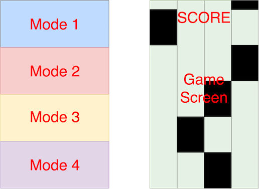

# Piano Tiles

### Background

Piano Tiles is a game where the player's objective is to tap black tiles while avoiding white tiles. The tiles will fall from top of the screen to the bottom of the screen in a straight line. When each tile is tapped, the player will hear a piano sound. The speed of tiles coming down will increase as the player keeps tapping more black tiles. The game ends when the player taps a white tile, or when a black tile disappears to the bottom of the screen.

### Functionality & MVP  

With this Piano Tiles game, users will be able to:

- [ ] Start, restart the game
- [ ] Use keyboard to tab black tiles
- [ ] Keep track of their highest score
- [ ] Pick a mode of their own choice

In addition, this project will include:

- [ ] An About modal describing the background and rules of the game
- [ ] A production README

### Wireframes

This app will consist of a single screen. Next to the main screen are nav links to Github repo, my LinkedIn, and my portfolio as well as highest score board.
The initial screen will have different mode options to choose from. They are clickable and change color when they are hovered. Once the player clicks a mode, the screen will change to the game board.

### Architecture and Technologies

This project will be implemented with the following technologies:

- Vanilla JavaScript and `jQuery` for overall structure and game logic,
- `EaselJS` with `HTML5 Canvas` for DOM manipulation and rendering,
- `SoundJS` for the game sound effect,
- Webpack to bundle and serve up the various scripts.

I will also look into `PreloadJS` and determine if this is necessary in later phase.

### Implementation Timeline

#### Phase 1
- [ ] Initial setup and install all necessary packages and libraries
- [ ] Learn `EaselJS` and `Canvas`
- [ ] Get a green bundle with `webpack`
- [ ] Learn enough `Easel.js` to create and render an object to the `Canvas` element
- [ ] Have tiles fall from top to bottom in correct order

#### Phase 2
- [ ] Learn `SoundJS`
- [ ] Randomly generate tiles and have them show up in correct order
- [ ] Able to tap the tiles using either mouse or keyboard
- [ ] Play some random key(sound) when tapping tiles
- [ ] Have tiles fall faster as more tiles are tapped

#### Phase 3
- [ ] Have the game keep track of the highest score
- [ ] Generate different game modes
- [ ] Add user interface which allows user to start/restart/quit the game
- [ ] Integrate with some real music, if possible

### Bonus features
- [ ] Add options for different color themes
- [ ] User able to pause the game
- [ ] Player can record his or her playing and can play the record
