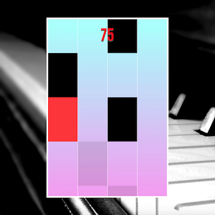

# Tap That Tile

[Play](http://www.echeon.me/tap-that-tile)

### About

Tap That Tile is a game clone of a popular mobile game called `Piano Tiles 2`.

Tap That Tile is a game where the player's objective is to tap black tiles while avoiding white tiles. The tiles will fall from top of the screen to the bottom of the screen in a straight line. When each tile is tapped, the player will hear a piano sound. The speed of tiles coming down will increase as the player keeps tapping more black tiles. The game ends when the player taps a white tile, or when a black tile disappears to the bottom of the screen.

### How To Play
