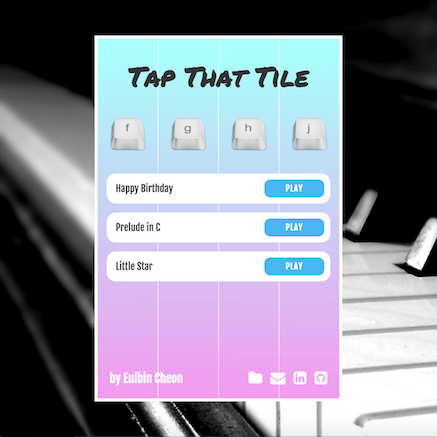

# Tap That Tile

[CLICK HERE TO PLAY!](http://www.echeon.me/tap-that-tile)

### About

Tap That Tile is a game clone of a popular mobile game called [Piano Tiles 2](https://itunes.apple.com/us/app/piano-tiles-2-dont-tap-white/id1027688889?mt=8).

### How To Play

The objective of Tap That Tile is to tap only black tiles. The tiles will fall from the top of the screen in a straight line. All you need to do is to tap before it disappears! You don't need to wait until the tile reaches the bottom. But, you need to tap bottom-most tile first before tapping any other tiles!

### Keys

- `f`: To tap a tile in left-most column
- `g`: To tap a tile in second column from left
- `h`: To tap a tile in third column from left
- `j`: To tap the right-most column

You can also play using mouse, but probably you wouldn't want to... I think...
